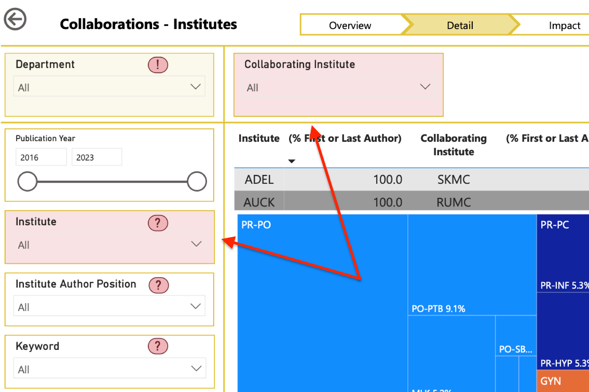

# Introduction
This documentation provides an overview of the obstetrics-gynaecology dashboard, which is designed to help researchers analyze data related to obstetrics and gynaecology.

The dashboard visualises data on research output collected from the Scopus database, using search queries in both PubMed and Scopus. Analysis of the societal relevance of research is based on data collected from Altmetric Explorer.

# Using the dashboard

## Navigation
Use the main navigation page to access the different chapters of the dashboard. You can return to the main navigation page at any time by clicking the Back-button in the top-left corner 
<svg width="24" height="24" viewBox="0 0 24 24" fill="none" xmlns="http://www.w3.org/2000/svg">
  <circle cx="12" cy="12" r="10" stroke="DimGray" stroke-width="2" fill="none"/>
  <path d="M16 12H8M12 9L9 12L12 15" stroke="DimGray" stroke-width="2" stroke-linecap="round" stroke-linejoin="round"/>
</svg>
 or through the navigation bar at the bottom of each page. Sections within each chapter can be accessed via the chapter navigation at the top of each page. Some chapters have multiple pages. Those pages can be accessed via the page navigation located above the visuals.

## Visuals
For each visual, more information is available by hovering your cursor over the *Page info* button in the top-right corner of the visual. This will open a pop-up window with details about the visual.

## Filters
The dashboard provides standard filters that can be applied to the data for each chapter. These filters allow you to narrow down the data based on *Department*, *Publication Year*, *Institute*, *Institute Author Position*, *Keyword*, *Topic*, and *Clinical Trial Status*. The filters are located in the left sidebar of the dashboard. Use [ctrl]{.small-caps}+click ([cmd]{.small-caps}+click for Mac users) to select multiple options. On some pages, additional filters are available above the visuals. Additional information is available by hovering over the red question mark 
<svg width="24" height="24" viewBox="0 0 24 24" fill="none" xmlns="http://www.w3.org/2000/svg">
  <rect x="2" y="6" width="20" height="12" rx="6" ry="6" fill="#ffcccc" stroke="#cc0000" stroke-width="2"/>
  <text x="12" y="15" text-anchor="middle" font-family="Arial, sans-serif" font-size="10" font-weight="bold" fill="#cc0000">?</text>
</svg>
 or exclamation mark 
<svg width="24" height="24" viewBox="0 0 24 24" fill="none" xmlns="http://www.w3.org/2000/svg">
  <rect x="2" y="6" width="20" height="12" rx="6" ry="6" fill="#ffcccc" stroke="#cc0000" stroke-width="2"/>
  <text x="12" y="15" text-anchor="middle" font-family="Arial, sans-serif" font-size="10" font-weight="bold" fill="#cc0000">!</text>
</svg>
 next to the filter.

If a filter is highlighted in red, you *must* make a selection. You cannot interpret the data without selecting at least one option for those filter. Below is a screenshot from the Collaborations chapter, showing such highlighted filters.

Filters highlighted in yellow come with additional warnings or information. Additional information is available by hovering over the red question mark 
<svg width="24" height="24" viewBox="0 0 24 24" fill="none" xmlns="http://www.w3.org/2000/svg">
  <rect x="2" y="6" width="20" height="12" rx="6" ry="6" fill="#ffcccc" stroke="#cc0000" stroke-width="2"/>
  <text x="12" y="15" text-anchor="middle" font-family="Arial, sans-serif" font-size="10" font-weight="bold" fill="#cc0000">?</text>
</svg>
 or exclamation mark 
 <svg width="24" height="24" viewBox="0 0 24 24" fill="none" xmlns="http://www.w3.org/2000/svg">
  <rect x="2" y="6" width="20" height="12" rx="6" ry="6" fill="#ffcccc" stroke="#cc0000" stroke-width="2"/>
  <text x="12" y="15" text-anchor="middle" font-family="Arial, sans-serif" font-size="10" font-weight="bold" fill="#cc0000">!</text>
</svg>
 next to the filter name.

# Caveats

The dashboard is designed to provide a general overview of the data and trends in obstetrics and gynaecology research. However, there are some caveats to keep in mind when interpreting the data. 

## Risk of outliers

The collection of data underlying the dashboard is relatively small. This is not an important issue when looking at the data as a whole, but it can lead to outliers when looking at specific subgroups. For example, if using the filters to look only at publications from a specific department where that department has a key author position and the publication reports on a clinical trial, the number of publications may be very small. In such cases, the data is likely not representative of the overall data. Unrepresentative values for one of those publications (that is, outliers) can skew the results.

## Filtering limits the data

Information for the *Topics* and *Clinical Trials* filters was retrieved from PubMed using custom search queries specifically developed for this purpose. Using this filters will exclude the publications retrieved from Scopus (approximately twenty per cent of all data) from the data used to generate the visuals! The exact percentage of missed publications can be deduced from the source page visible via the "Dashboard Design & Limitations" page.
